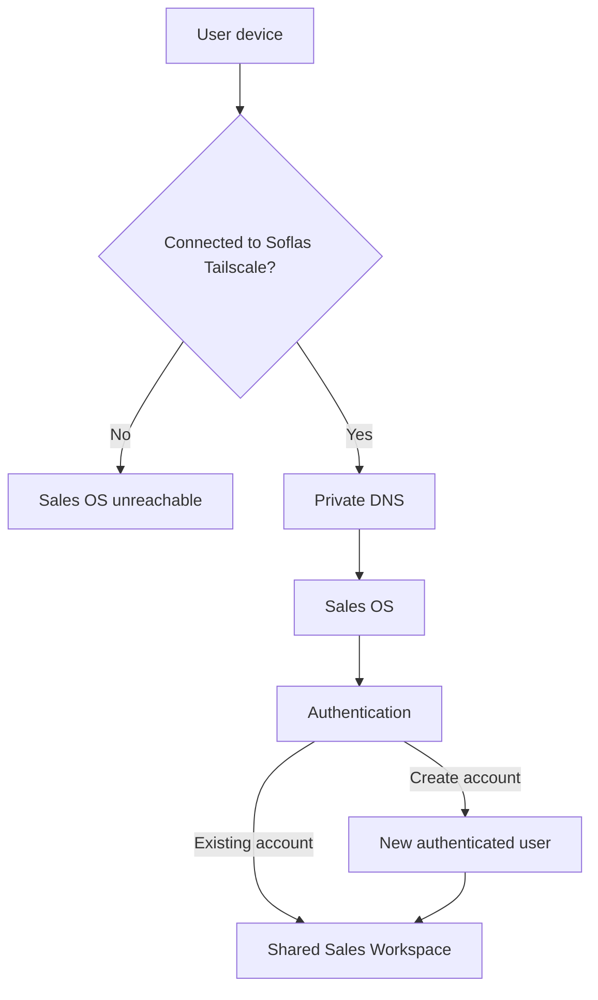
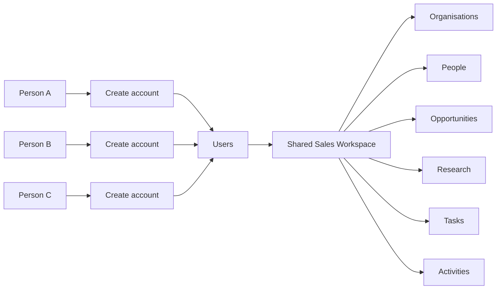
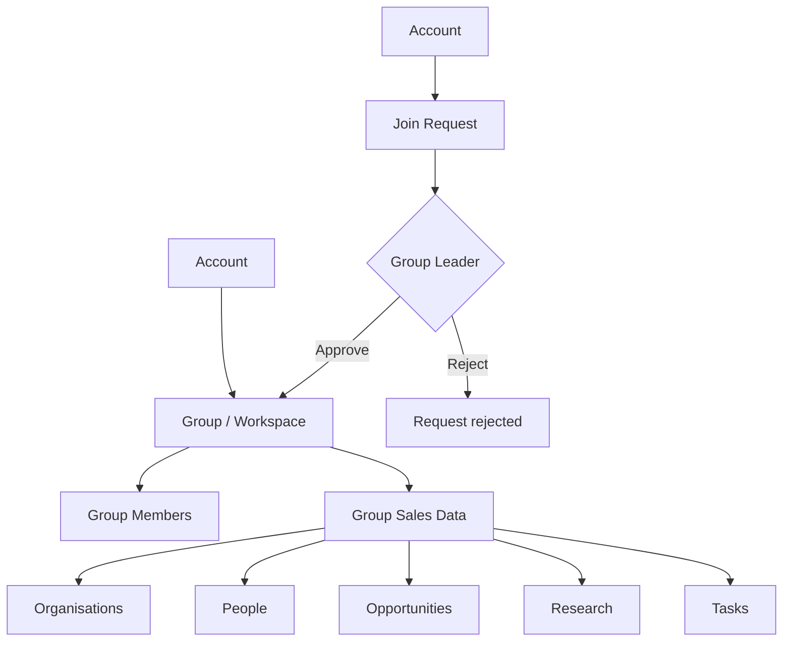
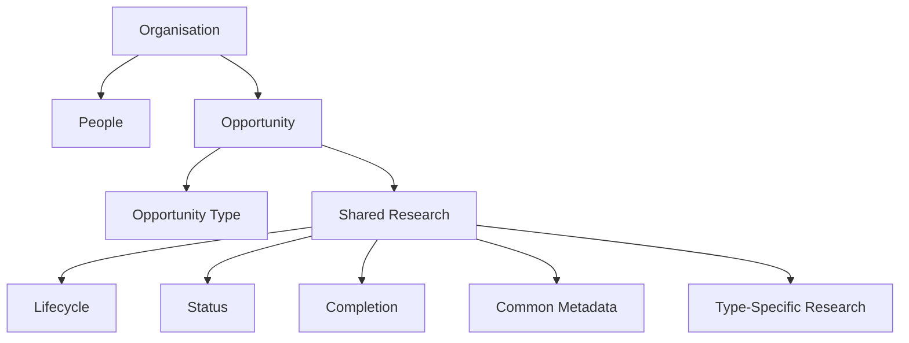
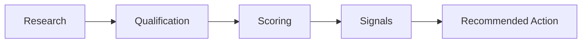
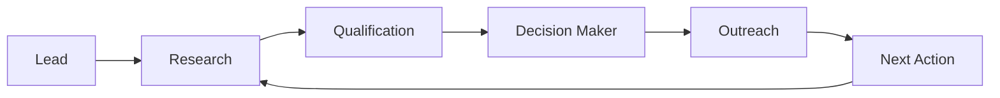
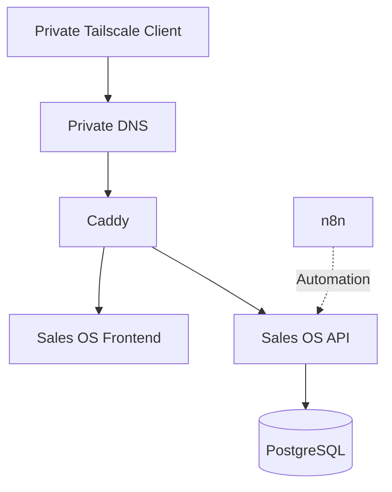

# Sales OS

> A purpose-built sales assistant for small business outreach, turning prospects into researched, qualified opportunities with scoring and recommended next actions.

Sales OS is a sales workflow application built to help small businesses run focused outbound outreach without turning the process into a complicated CRM.

It helps move a prospect through:

**Lead → Research → Qualification → Decision Maker → Outreach → Next Action**

The system keeps the information collected during that process connected so that research, qualification, scoring, and recommended actions can work together.

---

## Why I built it

Traditional CRM systems can be powerful, but they can also make simple sales actions feel unnecessarily heavy.

Sales OS was built around a simple principle:

> **If an action can be completed in 2–3 taps on a phone, it should not become a 10-field form.**

The current system is shaped around real outreach workflows. It is intentionally purpose-built rather than pretending to be a fully generic CRM.

Different opportunities can require completely different research questions and evidence. Instead of forcing every opportunity into one rigid research form, Sales OS separates shared sales concepts from opportunity-specific research.

---

## What it currently does

* Organisations and reusable people records
* Sales opportunities and pipeline stages
* Prospect research workflows
* Opportunity-specific research types
* Decision-maker identification and tracking
* Interaction and activity history
* Notes and tasks
* Opportunity scoring
* Action intelligence
* Recommended next actions
* Prospecting queues
* Mobile-oriented execution workflows
* PostgreSQL-backed persistence
* JWT authentication
* Docker-based deployment

---

## Current system model

Sales OS currently operates as a **private, authenticated, shared sales workspace**.

The current deployment is not a public CRM service.

Access to the deployed Sales OS application is restricted at the network level to the Soflas Tailscale network. This means that a person must first be connected to the private network before they can reach the application.

Network access and account authentication serve different purposes:

* **Tailscale access** determines whether a device can reach Sales OS.
* **User authentication** determines whether a person can sign in.
* **Account registration** is available from within the private application.
* **Accounts currently share the same Sales OS data environment.**
* There are currently no separate user workspaces or tenants.

### Current access architecture



The public internet can still resolve the Sales OS hostname, but public requests are blocked by the application gateway. The private Tailscale path resolves the hostname to the server's Tailscale address and allows authorised network clients to reach the application.

---

## What happens when someone creates an account?

Account creation currently creates another authenticated user inside the **same Sales OS deployment**.

For example:



This means that creating an account **does not currently create a private workspace**.

For example, if Person A creates an organisation, Person B can work with that organisation after authenticating because both accounts currently operate against the same shared sales data.

Likewise, opportunities, people, research, notes, tasks, activities, and related sales information belong to the shared current workspace rather than to an individual account.

This is intentional for the current stage of development.

---

## Current collaboration model

The current conceptual model is:

```text
ACCOUNT
    ↓
Authenticated person

        +

SHARED SALES WORKSPACE
    ↓
Organisations
People
Opportunities
Research
Tasks
Activities
Notes
```

There is currently **no**:

* User-owned workspace
* Group ownership
* Tenant isolation
* Workspace-specific database boundary
* Membership approval system
* Per-group data isolation

The application should therefore currently be understood as a **private shared workspace**, not as a multi-tenant SaaS platform.

---

## Future collaboration model

A future version may introduce explicit **groups or workspaces**.

The intended conceptual architecture is:



A possible future workflow would be:

```text
Person A
   │
   └── Creates Group Alpha
             │
             ├── Person B → requests to join → approved
             ├── Person C → requests to join → approved
             └── Person D → requests to join → pending
```

The future model is intended to provide a clear relationship between:

```text
Account
   ↓
Group / Workspace
   ↓
Membership
   ↓
Shared sales data within that group
```

This is **future architecture only**. It is not currently implemented.

The current shared-workspace model should remain simple until there is a real need for group and membership separation.

---

## Research architecture

The current research model follows this structure:



This allows the application to keep common sales concepts consistent while allowing different opportunity types to ask different research questions.

At the moment, these research workflows are intentionally implemented around the specific outreach use cases the system is being used for.

---

## Scoring and action intelligence

Research is not collected just for the sake of storing information.

The information gathered during prospecting can affect qualification and scoring, which can then influence the actions the system recommends.

The intended flow is:



The system is therefore designed to answer not only:

> "What do we know about this prospect?"

but also:

> "Given what we know, what should happen next?"

---

## Sales workflow

The broader sales workflow is:



The workflow is deliberately designed as a loop rather than a one-way process. New information from outreach can lead to additional research, qualification changes, or a different next action.

---

## Current direction

The longer-term goal is to make research types configurable.

Instead of hard-coding every research workflow, future versions should allow a user to define their own research questions and evidence requirements while keeping the underlying scoring and recommendation contract consistent.

The project is therefore evolving incrementally:

```text
Purpose-built workflows
        ↓
Reusable research architecture
        ↓
Configurable research types
        ↓
Consistent scoring
        ↓
Context-aware recommendations
```

The same incremental approach applies to collaboration:

```text
Private shared workspace
        ↓
Groups / Workspaces
        ↓
Membership management
        ↓
Group-level data separation
```

Future architecture should be introduced when it solves a real problem rather than being added prematurely.

---

## Technology

| Area           | Technology        |
| -------------- | ----------------- |
| Frontend       | React             |
| Build tool     | Vite              |
| Styling        | Tailwind CSS      |
| Backend        | Node.js + Fastify |
| Database       | PostgreSQL        |
| Authentication | JWT               |
| Deployment     | Docker Compose    |
| Automation     | n8n               |

---

## Deployment architecture

The application is containerised and consists of separate application components.



The public website and Sales OS are separate concerns.

Sales OS is intentionally protected at the network/application gateway layer rather than exposing its application ports directly to the public internet.

---

## Project structure

```text
sales-os/
├── api/
│   ├── migrations/
│   └── src/
├── database/
│   └── migrations/
├── frontend/
│   └── src/
├── n8n/
├── scripts/
├── storage/
├── docker-compose.yml
└── README.md
```

---

## Running locally

### Requirements

* Docker
* Docker Compose
* Git

### Setup

Clone the repository:

```bash
git clone https://github.com/Oleboheng/sales-os.git
cd sales-os
```

Create your local environment file:

```bash
cp .env.example .env
```

Edit `.env` and provide your own database password and JWT secret.

Then start the application:

```bash
docker compose up -d --build
```

The exact ports can be configured through `.env`.

---

## Important security notes

Do not commit:

```text
.env
Database runtime data
Database backups
Generated application data
Local credentials or secrets
```

The repository includes a `.gitignore` intended to keep these files out of version control.

For private deployments, network access and application authentication should be treated as separate security layers.

---

## Development philosophy

Sales OS is being developed around a few practical principles.

### 1. Keep the sales workflow fast

The application should help the salesperson move forward rather than create administrative work.

### 2. Keep organisations and people reusable

An organisation and its people should be useful sources of truth across opportunities rather than being repeatedly recreated.

### 3. Let research match the opportunity

Different sales opportunities can require different evidence. Research should be specific enough to be useful without forcing unrelated questions into every workflow.

### 4. Turn information into action

Research should contribute to qualification, scoring, and recommendations rather than becoming a passive database.

### 5. Keep collaboration simple until separation is needed

The current shared workspace is intentional. Groups, membership approval, and workspace-level data separation are future capabilities rather than requirements being forced into the current architecture prematurely.

### 6. Evolve from real usage

The system is developed incrementally around real outreach workflows. Abstractions are introduced when they solve an actual problem rather than being added only for theoretical flexibility.

---

## Status

Sales OS is an actively evolving project.

The current implementation works for the outreach workflow it was designed for, while the architecture is being developed toward a more configurable sales assistant.

The current deployment is a **private, authenticated, shared workspace**.

It is **not** currently presented as:

* a finished universal CRM;
* a multi-tenant SaaS platform;
* a system with isolated user workspaces;
* a system with group membership management.

Those capabilities may be introduced as the project evolves.

---

## Contributing

The project is public, but the main branch is intended to remain under maintainer control.

If you would like to propose a change, open an issue or submit a pull request so the change can be reviewed before it is merged.

---

## License

No open-source license has been added yet.

Until a license is added, the source code should not be assumed to be freely reusable or redistributable beyond the permissions granted by applicable GitHub functionality.

---

Built by **Oleboheng Tladie / Soflas Developments**.
